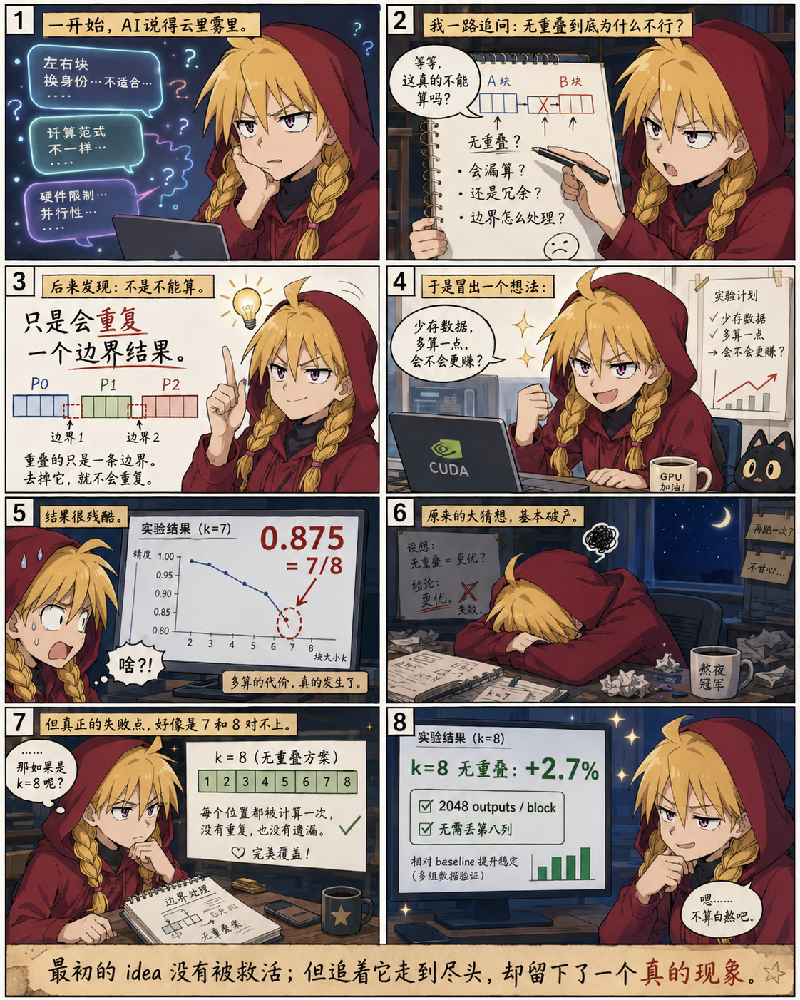

# ConvStencil Reading Log

用于逐步阅读与理解论文 **ConvStencil: Transform Stencil Computation to Matrix Multiplication on Tensor Cores**。
阅读采用了边读边问 AI 的方式，并使用 Issue 存档并追踪问题。

- Issues 内有 **我与 AI 问答全记录**（GPT 5.6 Sol），附有详实标签。
  - 其中标签为 `good first issue` 表示很重要， `enhancement` 和讨论中 AI 含糊其辞被我抓住分析、最终引出实验的内容有关。
- 仓库内主要是**浓缩了个人阅读和思考精华的[自写讲义](roadmap.md)** （GitHub 阅读体验差，建议在本地使用 typora），发布版见 release。
  - 还有其他理解过程中 AI 生成的图片网页（多为废案），以及翻译稿（很奇怪很不正式）。
- `experiments` 文件夹内是在 [#59](https://github.com/leo-grayrat/convstencil-reading-log/issues/59) 的启发下进行的临时实验。
  - 由于是临时验证，代码由 Codex 完成。用于简单验证**个人思考得出的零冗余**是否为一条可行有效道路。
 
## 必要说明

1. 本仓库仅讲义为原创，其他图片（AI 生成图片、网络资源图片）及论文原文，作者均不对其拥有版权。若有侵权，可联系删除。
2. 在 issue 中有一些问题较为考量论文的行文组织，只是就事论事，不排除部分问题指责过当。如有冒犯在此表示抱歉。
3. 本项目使用了 AI 编写部分总结文案、大量辅助我理解的解释，以及生成一些图片、完成实验代码。不代表作者鼓励这种万事 AI 的态度，更不代表作者赞同 AI 漫画。下图漫画仅在深夜破防时给自己打气作用。

> ## 工作方式
>
> - 每个阅读问题单独创建一个 GitHub Issue。
> - Issue 正文保留问题原文；回答、修正、补充和网页迭代都追加到评论中，不覆盖历史。
> - 用户明确接受回答或产物后，Issue 以 **Completed** 关闭。
> - 如果解释方向、网页或方案被明确否定并放弃，Issue 以 **Not planned** 关闭。
> - 新问题如果属于已有问题的细分，在正文中互相链接，形成可追踪的问题树。
>
> ## 仓库结构
>
> - `paper/`：原论文
> - `translation/`：阅读过程中生成的中文翻译稿
> - `presentation/handout/`：整理后的 LaTeX 汇报稿及相关素材
> - `experiments/`：阅读过程中衍生的实验与验证
> - `docs/`：主要为一些关于实验思路发现的 AI 总结，如果不想看太多 issue 可以看这里速览
> - `demos/`：用于辅助解释论文内容的网页和图示，多为废案
> - `artifacts/`：GPT Image 生成的展示图片
> - `tools/`：过程中使用的小工具和脚本（md 导出 latex）

-----

> そばにいてくれてありがとう
> **僕は負けないよ**
>
>
> ——〇✕△□ - 浪漫派マシュマロ
