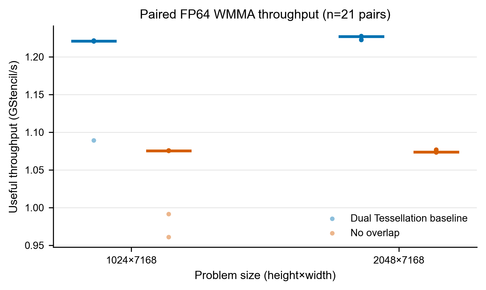
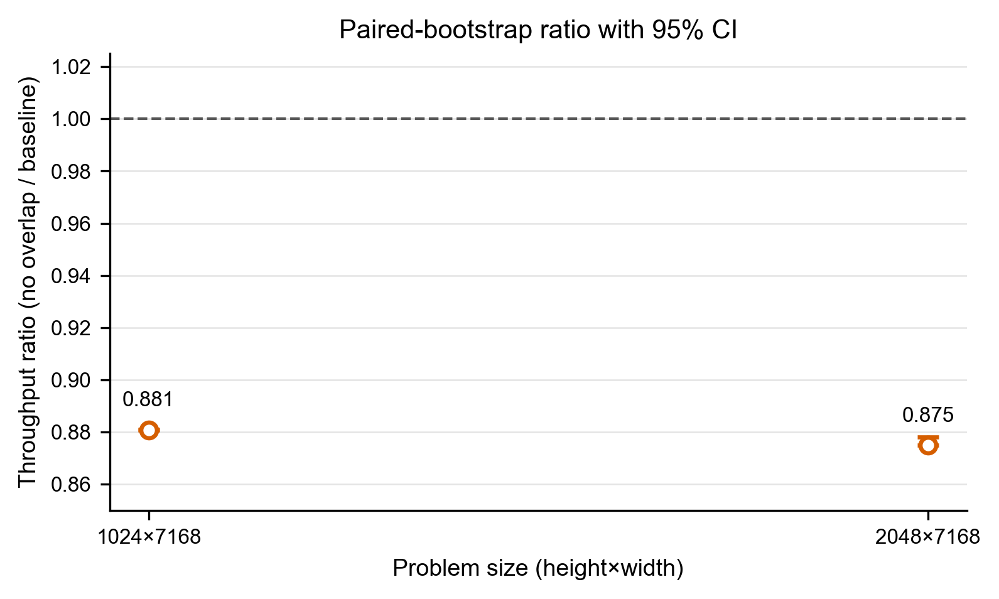

# RTX 5060 Laptop 固定规模实验结果

## 结论

在本实验锁定的 FP64 `8x8x4` WMMA、相同 13+13 条矩阵指令和相同有用输出定义下，无重叠方案未超过 ConvStencil Box-2D49P Dual Tessellation 基线：

- `1024x7168`：无重叠方案达到基线吞吐的 **88.085%**，吞吐低 **11.915%**；
- `2048x7168`：无重叠方案达到基线吞吐的 **87.499%**，吞吐低 **12.501%**。

两个规模给出的趋势一致。就 Issue #66 的窄问题而言，当前无重叠布局虽然消除了重叠写入，但没有转化为更高的有用吞吐。

## 固定方法

- GPU：NVIDIA GeForce RTX 5060 Laptop GPU；驱动 `592.19`；
- 编译目标：CUDA `sm_120`；能力门确认实际生成并执行 FP64 `DMMA.8x8x4`；
- 正确性：`32x448`，两内核最大绝对误差均为 `2.6645352591003757e-15`；
- 每个内核：5 次预热；
- 每个规模：21 对样本，按 `AB/BA` 交替顺序采集；
- 单个计时窗口目标：150 ms，实际窗口均处于 100--300 ms；
- 统计量：单次内核时间中位数、IQR、有用输出 GStencil/s、无重叠/基线吞吐比、10,000 次成对 bootstrap 95% CI；
- 重试规则：最大相对 IQR 超过 5% 时等待 2 分钟并重试一次。本次两个规模均未触发重试；
- 总脚本耗时：`20.336 s`，低于 30 分钟硬预算。

## 数值结果

| 规模 | 基线中位数 (ms) | 基线 IQR (ms) | 基线 (GStencil/s) | 无重叠中位数 (ms) | 无重叠 IQR (ms) | 无重叠 (GStencil/s) | 吞吐比 | 成对 bootstrap 95% CI |
| --- | ---: | ---: | ---: | ---: | ---: | ---: | ---: | ---: |
| 1024x7168 | 6.011731 | 0.003036 | 1.220951 | 6.824940 | 0.001043 | 1.075472 | 0.880847 | [0.880740, 0.881093] |
| 2048x7168 | 11.964785 | 0.043993 | 1.226939 | 13.674200 | 0.040690 | 1.073559 | 0.874990 | [0.874943, 0.878054] |

## 稳定性与限制

`1024x7168` 的最初样本可见升频过渡：基线第 0 对和无重叠方案第 0--1 对慢于后续样本。为遵守预先确定的统计方法，本报告没有删除这些点；21 对样本的中位数对其不敏感。所选样本的最大相对 IQR 分别为 `0.0505%` 和 `0.3677%`，均远低于 5% 重试阈值。

本结果只回答当前实现、当前 GPU 与两个固定规模下的性能趋势，不能外推为所有 stencil 尺寸、精度或架构上的普遍结论。本次没有运行 Nsight，因为稳定的成对结果已经足以回答主问题，额外 profiling 不会改变比较结论。

## 证据文件

- `benchmark-plan.json`：运行前锁定的尺寸、顺序、样本数和预算；
- `measure-*.stdout.log`：两个内核输出的逐对原始 JSON；
- `measure-*.stderr.log`：本次均为空；
- `raw-timings.csv`：84 行逐内核计时数据；
- `summary.json`：中位数、IQR、吞吐和置信区间；
- `environment.json`：运行前后 GPU 状态快照；
- `throughput.{png,svg}` 与 `throughput-ratio.{png,svg}`：由 `scripts/plot_results.py` 从上述数据重建。
