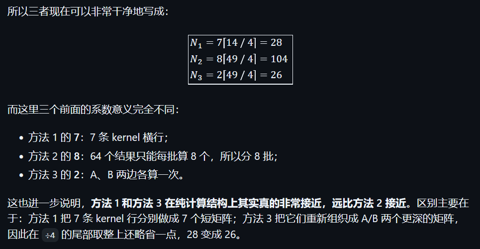
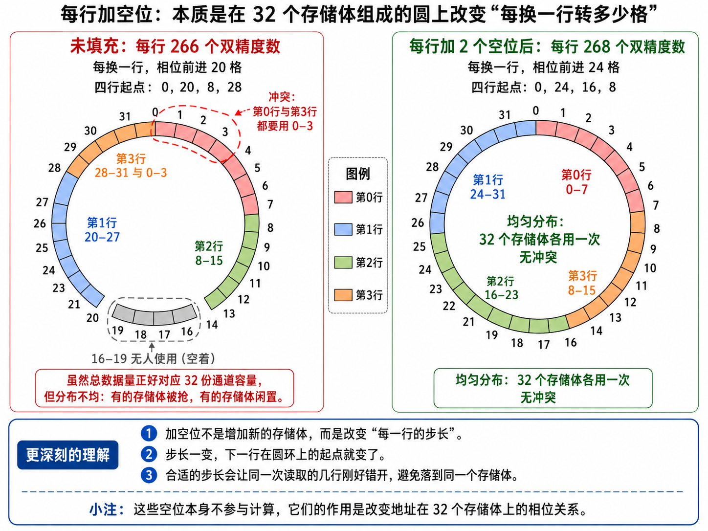
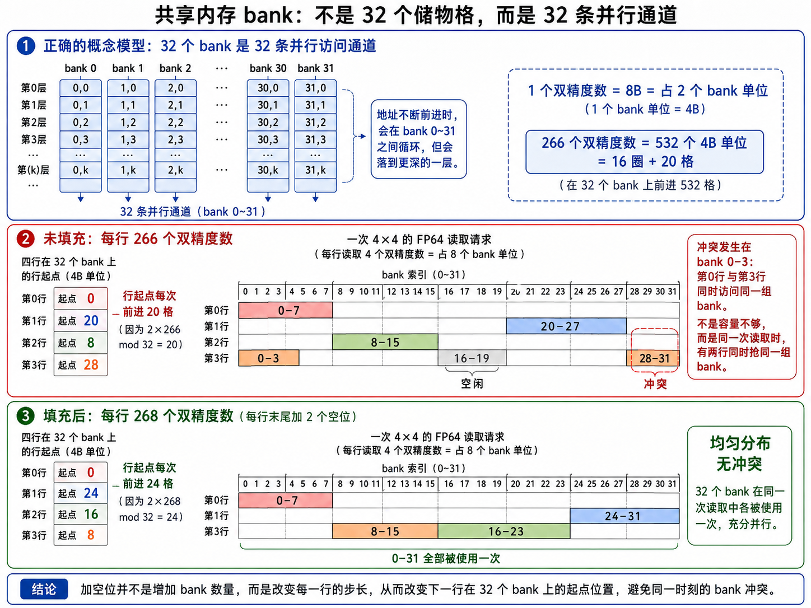
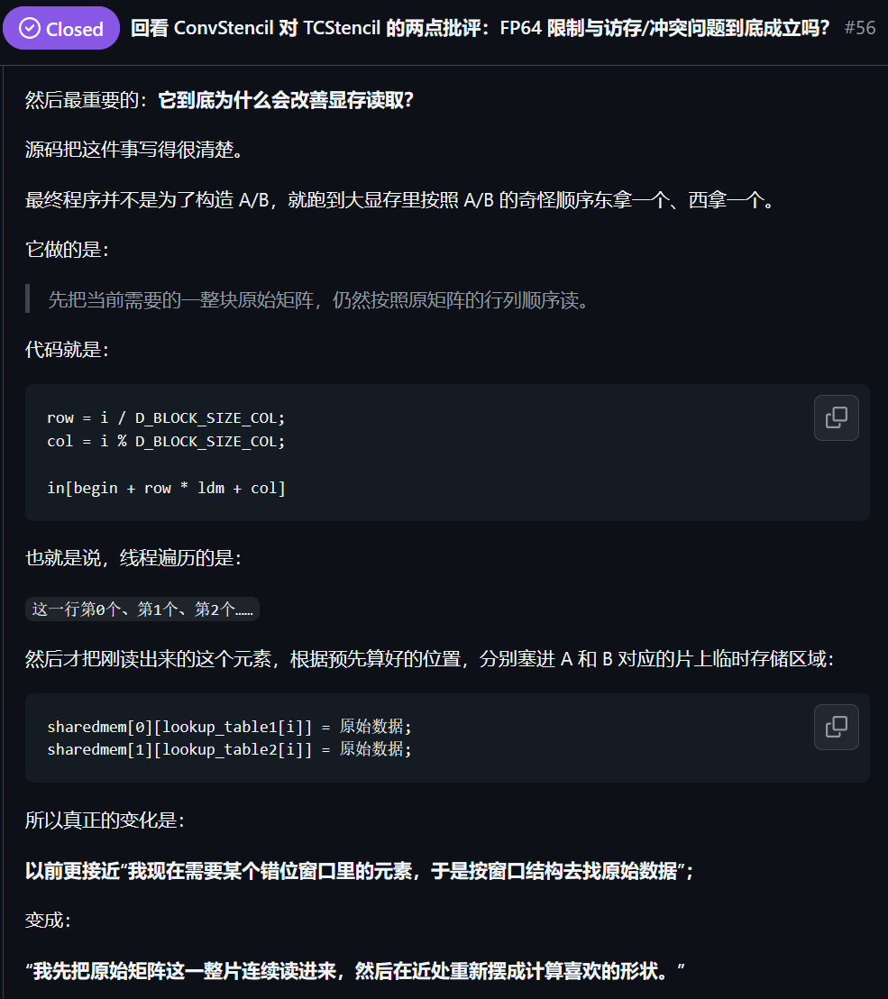
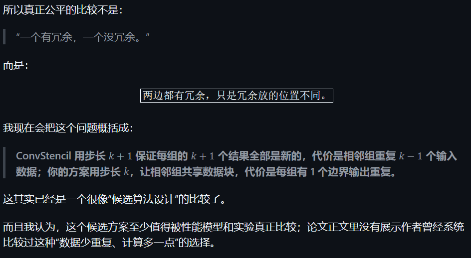
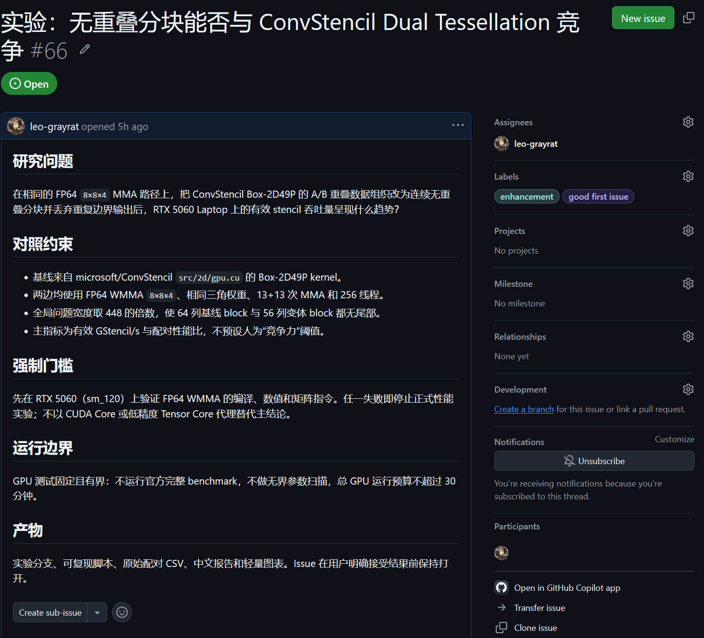
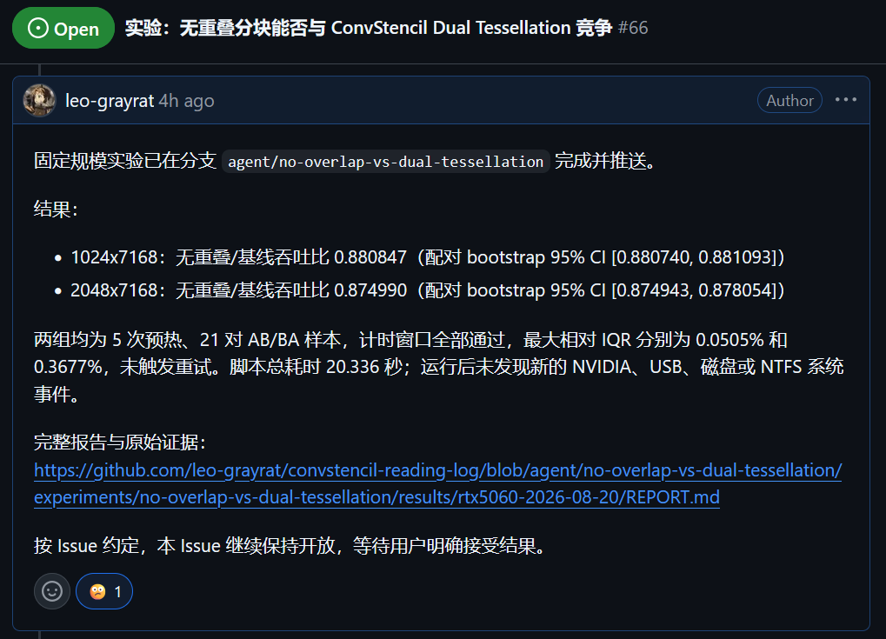

## Stencil 计算

本意是一种更新算法，时刻 t 的一个点，由 t−1 时刻**自己和附近点的加权和**决定。

这种运算在自然科学中十分常用，流体动力学、地球建模、天气模拟都常见。

如热传导：

$$
\begin{matrix}
冷\;冷\;冷\\
冷\;热\;冷\\
冷\;冷\;冷
\end{matrix}
$$

## 那数学上呢？


模板计算，用确定的计算模板**在整个规则网格上反复滑动，并对覆盖到的数据执行同一种运算。**

## 一维情况

$$
\mathbf a=\left( 
\begin{array}{l}
1&2&3&4&5&6
\end{array}
\right)
$$

有模板

$$
\mathbf w=\left( 
\begin{array}{l}
a&b&c
\end{array}
\right)
$$

计算范式即

$$
r_k=\sum_{i=k}^{k+2}a_iw_i
$$

则有

$$
\begin{align}
1处: r_1=1a+2b+3c\\
2处: r_2=2a+3b+4c\\
3处: r_3=3a+4b+5c\\
4处: r_4=4a+5b+6c
\end{align}
$$

但是单纯算这样朴素乘加并不合适，我们有很多矩阵计算的硬件，能不能把这种计算化成**矩阵乘法**呢？反正都是 $\sum a_ib_i$ 乘加的形式~

为了方便讨论，鉴于这里有种对数据加权的样子，称模板向量及其元素为**权重**。

## 方法一

让我们对齐一下：

$$
\begin{align}
1处: r_1=1a+2b + \textcolor{red}{3}&c\\
2处: r_2=2a+\textcolor{red}{3}&b+\textcolor{red}{4}c\\
3处: r_3=\textcolor{red}{3}&a+\textcolor{red}{4}b+5c\\
4处: r&_4=\textcolor{red}{4}a+5b+6c\\
\end{align}
$$

可以发现，随着 stencil 在原数据上滑动，相对于原数据来看，权重也在滑动，只是错了一位而已。

把权重按照滑动的方式排列成一个矩阵，乘上 $\mathbf a$ ：

$$
\begin{bmatrix}
a&b&c&0&0&0\\
0&a&b&c&0&0\\
0&0&a&b&c&0\\
0&0&0&a&b&c
\end{bmatrix}
\begin{bmatrix}
1\\
2\\
3\\
4\\
5\\
6
\end{bmatrix}
=\begin{bmatrix}
1a+2b+3c\\
2a+3b+4c\\
3a+4b+5c\\
4a+5b+6c
\end{bmatrix}
$$

这种方法中重复排列的是**权重**。

## 方法二

更简单的方法是把每个滑动窗口都抄下来。

$$
1处: r_1=1\textcolor{red}{a}+2\textcolor{red}{b}+3\textcolor{red}{c}\\
2处: r_2=2\textcolor{red}{a}+3\textcolor{red}{b}+4\textcolor{red}{c}\\
3处: r_3=3\textcolor{red}{a}+4\textcolor{red}{b}+5\textcolor{red}{c}\\
4处: r_4=4\textcolor{red}{a}+5\textcolor{red}{b}+6\textcolor{red}{c}
$$

显然，**权重**都是统一的。我们可以把权重**提取出来**作为一个向量：

$$
\mathbf r=\left[ 
\begin{matrix}
r_1\\
r_2\\
r_3\\
r_4
\end{matrix}
\right]=
\left[ 
\begin{matrix}
1&2&3\\
2&3&4\\
3&4&5\\
4&5&6
\end{matrix}
\right]
\left[ 
\begin{matrix}
\textcolor{red}{a}\\
\textcolor{red}{b}\\
\textcolor{red}{c}
\end{matrix}
\right]
=\left[ 
\begin{matrix}
1\textcolor{red}{a}+2\textcolor{red}{b}+3\textcolor{red}{c}\\
2\textcolor{red}{a}+3\textcolor{red}{b}+4\textcolor{red}{c}\\
3\textcolor{red}{a}+4\textcolor{red}{b}+5\textcolor{red}{c}\\
4\textcolor{red}{a}+5\textcolor{red}{b}+6\textcolor{red}{c}
\end{matrix}
\right]
$$

这种方法中重复排列的是**数据**。

## 推广到二维

如 $3\cross3$ stencil：

$$
\begin{bmatrix}
a & b & c \\
d & e & f \\
g & h & i
\end{bmatrix}
$$

只是把向量换成了二维矩阵而已，运算还是各元素和数据元素乘加。

如在 $(p,q)$ 处的 stencil 计算结果：

$$
y_{p,q} = 
\begin{aligned}[t]
& a x_{p-1,q-1} + b x_{p-1,q} + c x_{p-1,q+1} \\
& + d x_{p,q-1} + e x_{p,q} + f x_{p,q+1} \\
& + g x_{p+1,q-1} + h x_{p+1,q} + i x_{p+1,q+1}
\end{aligned}
$$

---

以此 $3\cross5$ 矩阵为数据来说明。

$$
\begin{bmatrix}
1 & 2 & 3 & 4 & 5 \\
6 & 7 & 8 & 9 & 10 \\
11 & 12 & 13 & 14 & 15
\end{bmatrix}
$$

从一维的小向量的移动，变成了小矩阵的移动。

$$
X_{0,0} = \begin{bmatrix}
1 & 2 & 3 \\
6 & 7 & 8 \\
11 & 12 & 13
\end{bmatrix}\to
X_{0,1} = \begin{bmatrix}
2 & 3 & 4 \\
7 & 8 & 9 \\
12 & 13 & 14
\end{bmatrix}\to
X_{0,2} = \begin{bmatrix}
3 & 4 & 5 \\
8 & 9 & 10 \\
13 & 14 & 15
\end{bmatrix}
$$

## 方法一

$$
y_{p,q}=
\begin{array}[t]{r@{}l@{\quad}l}
& a x_{p-1,q-1} + b x_{p-1,q} + c x_{p-1,q+1} & \makebox[0pt][r]{...... 第1行} \\
& + d x_{p,q-1} + e x_{p,q} + f x_{p,q+1} & \makebox[0pt][r]{...... 第2行} \\
& + g x_{p+1,q-1} + h x_{p+1,q} + i x_{p+1,q+1} & \makebox[0pt][r]{...... 第3行}
\end{array}
$$

二维 stencil 的每一行实际上就是**一个一维 stencil** ！

如第一行：

$$
\begin{pmatrix}
1 & 2 & 3 & 4 & 5 
\end{pmatrix}
\;\text{with}\;
\begin{pmatrix}
a&b&c
\end{pmatrix}
$$

对应 stencil 窗口矩阵中的第一行。

$$
X_{0,0} = \begin{bmatrix}
\textcolor{red}{1} & \textcolor{red}{2} & \textcolor{red}{3} \\
6 & 7 & 8 \\
11 & 12 & 13
\end{bmatrix}\to
X_{0,1} = \begin{bmatrix}
\textcolor{red}{2} & \textcolor{red}{3} & \textcolor{red}{4} \\
7 & 8 & 9 \\
12 & 13 & 14
\end{bmatrix}\to
X_{0,2} = \begin{bmatrix}
\textcolor{red}{3} & \textcolor{red}{4} & \textcolor{red}{5} \\
8 & 9 & 10 \\
13 & 14 & 15
\end{bmatrix}
$$

既然如此，分行计算一维 stencil 的和、累加起来即可。

## 方法二

$$
y_{p,q} = 
 a x_{p-1,q-1} + b x_{p-1,q} + c x_{p-1,q+1} 
 + \dots 
 + g x_{p+1,q-1} + h x_{p+1,q} + i x_{p+1,q+1}
$$

就算是二维，还是一样的乘加结构，只是变成 $k^2$ 个数了。

这种方法对每个维度都比较简单——把所有可能的滑动窗口里面数据一个个抄下来就可以了，不管这个窗口是几维度。

$$
X_{0,0} = \begin{bmatrix}
{1} & {2} & {3} \\
6 & 7 & 8 \\
11 & 12 & 13
\end{bmatrix}\;
X_{0,1} = \begin{bmatrix}
{2} & {3} & {4} \\
7 & 8 & 9 \\
12 & 13 & 14
\end{bmatrix}\;
X_{0,2} = \begin{bmatrix}
{3} & {4} & {5} \\
8 & 9 & 10 \\
13 & 14 & 15
\end{bmatrix}
$$

直接展开**摊平为向量**，记录下所有元素。

$$
\begin{align}
\mathbf x&_{(0,0)}=(1,2,3,6,7,8,11,12,13)\\
\mathbf x&_{(0,1)}=(2,3,4,7,8,9,12,13,14)\\
\mathbf x&_{(0,2)}=(3,4,5,8,9,10,13,14,15)
\end{align}
$$

然后把权重向量也摊平为向量。

$$
\mathbf w = \begin{pmatrix}
a & b &c &\dots&h&i
\end{pmatrix}
$$

然后向量合并为矩阵：

$$
\begin{bmatrix}
\mathbf x_{(0,0)} \\
\mathbf x_{(0,1)} \\
\mathbf x_{(0,2)}
\end{bmatrix}
\mathbf w^\top
=\begin{bmatrix}
1 & 2 & 3 & 6 & 7 & 8 & 11 & 12 & 13 \\
2 & 3 & 4 & 7 & 8 & 9 & 12 & 13 & 14 \\
3 & 4 & 5 & 8 & 9 & 10 & 13 & 14 & 15
\end{bmatrix}
\begin{bmatrix}
a\\
b\\ 
c\\
\vdots\\
h\\
i
\end{bmatrix}
=\begin{bmatrix}
1a+2b+3c\dots\\
2a+3b+4c\dots\\
3a+4b+5c\dots
\end{bmatrix}
$$

## 实际上……

- 方法一对应 `TCStencil` 方法。
  - 此方法不适用于我们今天研究所用的硬件，只能用在较对称的情况下。
  
  - 硬件问题稍后会提及，简而言之，其只适用于单精度 FP16 运算，不适用于双精度 FP64 运算。
  
    > `TCStencil` is constrained to symmetric MM on FP16 Tensor Cores (i.e. matrix multiplication of matrices with the same shape), while most stencil computation necessitates FP64 precision and only specific asymmetric MM is supported on FP64 Tensor Cores.
  
  - 不过我们稍后还会回来探讨这个……
  
- 方法二对应 `im2row` 方法
  - 但是从各种意义上说，这种方法都太冗余了……
  - 为什么这么说呢？

## 卷积……

实际上，这里的运算和**卷积**很像。

二维窗口在矩阵上滑动、跟对应权重相乘、得到结果累加输出……

上面方法二实际可以认为就是迁移卷积计算方法到 stencil。


既然如此，那为什么说方法二有问题呢？卷积在各领域的广泛使用不必多说啊……

## ……但不够卷

卷积中，一般卷积核不会只有一个，也就是说会有多套权重。

正因如此，卷积中的权重块是矩阵，而不是 $1\cross n$ 的**向量**。

卷积之所以能够如此便利地计算，就是因为转化成了**矩阵乘法**，可以套进对应大小的矩阵计算单元中。

但向量就没这么好的事情了。不同 stencil 之间的向量乘法也不能合并。

所以权重向量只能占据硬件提供的矩阵中的**一列**！

而硬件设计针对稠密矩阵乘法，不会管你 0 不 0 的，所以仍然会浪费大量计算资源……

## 文中？

> 1) When the original input is transformed into an im2row matrix, most elements in the im2row matrix are redundant and the transformation causes a space explosion.
> 2) In the im2row transformation, we observe that the data sequencing in redundant rows has been already stored beyond the redundant rows. 
> 3) Shared memory resides on-chip, so it has much lower latency than global memory.

很多行是重复 $\implies$ 而且还顺序重复 $\implies$ （因此可以只保留更少基准数据、按需构造到容易访问的内存） $\implies$ 读取更快

其实说的就是一件事：**消除有结构和规律的冗余重复**！

im2row 显式展开了大量彼此重叠的窗口，而这些重复内容可以由少量基准数据重构，因此不需要完整保存和搬运。

## 从方法二出发

一块 $3\cross6$ 数据：

$$
D=\begin{bmatrix}
1 & 2 & 3 & 4 & 5 & 6 \\
7 & 8 & 9 & 10 & 11 & 12 \\
13 & 14 & 15 & 16 & 17 & 18
\end{bmatrix}
$$

有四个滑动窗口：

$$
X_0 =
\begin{bmatrix}
1 & 2 & 3 \\
7 & 8 & 9 \\
13 & 14 & 15
\end{bmatrix},
\quad
X_1 =
\begin{bmatrix}
2 & 3 & 4 \\
8 & 9 & 10 \\
14 & 15 & 16
\end{bmatrix},
\quad
X_2 =
\begin{bmatrix}
3 & 4 & 5 \\
9 & 10 & 11 \\
15 & 16 & 17
\end{bmatrix},
\quad
X_3 =
\begin{bmatrix}
4 & 5 & 6 \\
10 & 11 & 12 \\
16 & 17 & 18
\end{bmatrix}
$$

如果再把这些展开然后写四遍，那确实有相当相当多的重复信息。

怎么办呢？

---

$$
X_0 =
\begin{bmatrix}
{\color{red}1} & {\color{red}2} & {\color{red}3} \\
{\color{red}7} & {\color{red}8} & {\color{red}9} \\
{\color{red}13} & {\color{red}14} & {\color{red}15}
\end{bmatrix},
\quad
X_1 =
\begin{bmatrix}
{\color{red}2} & {\color{red}3} & {\color{blue}4} \\
{\color{red}8} & {\color{red}9} & {\color{blue}10} \\
{\color{red}14} & {\color{red}15} & {\color{blue}16}
\end{bmatrix},
\quad
X_2 =
\begin{bmatrix}
{\color{red}3} & {\color{blue}4} & {\color{blue}5} \\
{\color{red}9} & {\color{blue}10} & {\color{blue}11} \\
{\color{red}15} & {\color{blue}16} & {\color{blue}17}
\end{bmatrix},
\quad
X_3 =
\begin{bmatrix}
{\color{blue}4} & {\color{blue}5} & {\color{blue}6} \\
{\color{blue}10} & {\color{blue}11} & {\color{blue}12} \\
{\color{blue}16} & {\color{blue}17} & {\color{blue}18}
\end{bmatrix}
$$

观察即可发现，中间两个矩阵里的信息在左右两个矩阵中都出现了。

换言之，我们可以直接把原矩阵信息**切分**成若干块，从而达到信息零冗余。剩余两个矩阵的元素都可以从 $A\;B$ 中得到，

$$
D=

\left[\begin{array}{c:c}
A & B 
\end{array}\right]

\implies A =
\begin{bmatrix}
1 & 2 & 3 \\
7 & 8 & 9 \\
13 & 14 & 15
\end{bmatrix},
\quad
B =
\begin{bmatrix}
4 & 5 & 6 \\
10 & 11 & 12 \\
16 & 17 & 18
\end{bmatrix}
$$

听起来很好，但是怎么算呢？

---

$$
\begin{align}

\mathbf{a}=\mathbf{x}_0 =&
\begin{bmatrix}
{\color{red}1} & {\color{red}2} & {\color{red}3} &
{\color{red}7} & {\color{red}8} & {\color{red}9} &
{\color{red}13} & {\color{red}14} & {\color{red}15}
\end{bmatrix}
\\


\mathbf{x}_1 =&
\begin{bmatrix}
{\color{red}2} & {\color{red}3} & {\color{blue}4} &
{\color{red}8} & {\color{red}9} & {\color{blue}10} &
{\color{red}14} & {\color{red}15} & {\color{blue}16}
\end{bmatrix}
\\


\mathbf{x}_2 =&
\begin{bmatrix}
{\color{red}3} & {\color{blue}4} & {\color{blue}5} &
{\color{red}9} & {\color{blue}10} & {\color{blue}11} &
{\color{red}15} & {\color{blue}16} & {\color{blue}17}
\end{bmatrix}
\\


\mathbf{b}=\mathbf{x}_3 =&
\begin{bmatrix}
{\color{blue}4} & {\color{blue}5} & {\color{blue}6} &
{\color{blue}10} & {\color{blue}11} & {\color{blue}12} &
{\color{blue}16} & {\color{blue}17} & {\color{blue}18}
\end{bmatrix}

\end{align}
$$

先看第一行的部分：

$$
\begin{align}

\mathbf{a}=\mathbf{x}_0 =&
\begin{bmatrix}
{\color{red}1} & {\color{red}2} & {\color{red}3}
\dots
\end{bmatrix}
\\


\mathbf{x}_1 =&
\begin{bmatrix}
&\;\;{\color{red}2} & {\color{red}3} & {\color{blue}4} 
\dots
\end{bmatrix}
\\


\mathbf{x}_2 =&
\begin{bmatrix}
&&\;\;\;\;{\color{red}3} & {\color{blue}4} & {\color{blue}5} 
\dots
\end{bmatrix}
\\


\mathbf{b}=\mathbf{x}_3 =&
\begin{bmatrix}
&&&\;\;\;\;\;\;{\color{blue}4} & {\color{blue}5} & {\color{blue}6} 
\dots
\end{bmatrix}

\end{align}
$$

由于这种滑动窗口结构，所以事实上出现了 $AAA\to AAB\to ABB\to BBB$ 的样式。

因此， $\mathbf a$ 和 $\mathbf b$ 对应的计算结果中的项在其他窗口 stencil 计算结果中也有出现！

$$
\begin{align}
r_0=\textcolor{red}1a+\textcolor{red}2b + \textcolor{red}{3}&c\\
r_1=\textcolor{red}2a+\textcolor{red}{3}&b+\textcolor{blue}{4}c\\
r_2=\textcolor{red}{3}&a+\textcolor{blue}{4}b+\textcolor{blue}5c\\
r&_3=\textcolor{blue}{4}a+\textcolor{blue}5b+\textcolor{blue}6c\\
\end{align}
$$

所以，这些计算结果可以由 $(1,2,3)$ 和 $(4,5,6)$ **线性表示**！
$$
\begin{align}
&r_0=(1,2,3)·(a,b,c)& +&(4,5,6)·\;\;\;\;\mathbf 0\\
&r_1=(1,2,3)·(0,a,b)& +&(4,5,6)·(c,0,0)\\
&r_2=(1,2,3)·(0,0,a)& +&(4,5,6)·(b,c,0)\\
&r_3=(1,2,3)·\;\;\;\;\mathbf 0 &+&(4,5,6)·(a,b,c)
\end{align}
$$

## Dual Tessellation	双重拼接

$$
{\color{red}W_{A1}}= 
\begin{bmatrix}
a & 0 & 0 & 0 \\
b & a & 0 & 0 \\
c & b & a & 0
\end{bmatrix}

{\color{blue}W_{B1}} = 
\begin{bmatrix}
0 & c & b & a \\
0 & 0 & c & b \\
0 & 0 & 0 & c
\end{bmatrix}
$$

把上面的线性变换的系数向量部分写成矩阵，然后就可以得到：

$$
\mathbf aW_{A1}+\mathbf b W_{B1}=\mathbf r_1
$$

很特别的是，这样构造出来的 A B 权重矩阵都是**三角矩阵**。这也是窗口滑动的体现之一。

如果把多行的结果放到一起，就会是这样：

$$
{\color{red}W_A}= 
\begin{bmatrix}
w_0 & 0 & 0 & 0 \\
w_1 & w_0 & 0 & 0 \\
w_2 & w_1 & w_0 & 0 \\
w_3 & 0 & 0 & 0 \\
w_4 & w_3 & 0 & 0 \\
w_5 & w_4 & w_3 & 0 \\
w_6 & 0 & 0 & 0 \\
w_7 & w_6 & 0 & 0 \\
w_8 & w_7 & w_6 & 0
\end{bmatrix}

{\color{blue}W_B} = 
\begin{bmatrix}
0 & w_2 & w_1 & w_0 \\
0 & 0 & w_2 & w_1 \\
0 & 0 & 0 & w_2 \\
0 & w_5 & w_4 & w_3 \\
0 & 0 & w_5 & w_4 \\
0 & 0 & 0 & w_5 \\
0 & w_8 & w_7 & w_6 \\
0 & 0 & w_8 & w_7 \\
0 & 0 & 0 & w_8
\end{bmatrix}
\\\\
\mathbf a{\color{red}{W_A}}+\mathbf b {\color{blue}{W_B}}=\mathbf r
$$

这就是本文 $\text{ConvStencil}$ 的中心方法—— AB 矩阵双重拼接！

## 零冗余？

刚刚只是一A一B的情况，如果更长呢？

按着之前的想法，我们只要把矩阵按照 stencil 一行的长度一个个切开就可以了，这样所有滑动窗口的信息都可以从一个个 A B 矩阵中得知了，完全不浪费信息……

## 但是……

如果这样分割 A B 矩阵：

$$
\begin{align}

\mathbf{a}=\mathbf{x}_0 =&
\begin{bmatrix}
{\color{red}1} & {\color{red}2} & {\color{red}3}
\dots
\end{bmatrix}
\\


\mathbf{x}_1 =&
\begin{bmatrix}
&\;\;{\color{red}2} & {\color{red}3} & {\color{blue}4} 
\dots
\end{bmatrix}
\\


\mathbf{x}_2 =&
\begin{bmatrix}
&&\;\;\;\;{\color{red}3} & {\color{blue}4} & {\color{blue}5} 
\dots
\end{bmatrix}
\\


\mathbf{b}=\mathbf{x}_3 =&
\begin{bmatrix}
&&&\;\;\;\;\;\;{\color{blue}4} & {\color{blue}5} & {\color{blue}6} 
\dots
\end{bmatrix}

\end{align}
$$

假设这里后续还有数据，那么就需要延续这样分块，交换一下 a b 的位置，让旧 b 变为新 a ，接着计算。新的一块理应是 $7\;8\;9$ 。

让我们 copy 一下：

$$
\begin{align}

\mathbf{a}=\mathbf{x}_3 =&
\begin{bmatrix}
{\color{red}4} & {\color{red}5} & {\color{red}6}
\dots
\end{bmatrix}
\\


\mathbf{x}_4 =&
\begin{bmatrix}
&\;\;{\color{red}5} & {\color{red}6} & {\color{blue}7} 
\dots
\end{bmatrix}
\\


\mathbf{x}_5 =&
\begin{bmatrix}
&&\;\;\;\;{\color{red}6} & {\color{blue}7} & {\color{blue}8} 
\dots
\end{bmatrix}
\\


\mathbf{b}=\mathbf{x}_6 =&
\begin{bmatrix}
&&&\;\;\;\;\;\;{\color{blue}7} & {\color{blue}8} & {\color{blue}9} 
\dots
\end{bmatrix}

\end{align}
$$

有没有发现不对劲？

## 植树问题

$\mathbf{x}_3$ **被算了两遍**！

```CPP
第0段：●─────●
      1 2 3 4 5 6 7
第1段：      ●─────●
```

就像植树问题一样：

- 如果我们中间每一段都这样处理首尾，那么中间每个节点都会被算两次；
- 如果每一段都只处理首节点和尾节点，那么整体的首节点和尾节点不会被计算！
- 如果打补丁，只有开头/结尾段处理首尾节点、其他都只处理一个，那破坏了计算统一的范式……
  - 我们稍后会回到这里！

看来完全无冗余是不可行的，那怎么办呢？加回一点冗余吗？怎么加呢？

## →

还是回到上面那个植树：

```CPP
第0段：●─────●
      1 2 3 4 5 6 7 8
第1段：        ●─────●
```

把新一段的起始点往右移一格不就行了？

此前，新一段的起始，也就是新 a ，来自于上一步的 b 。

现在这样改动后， a 就不能再抄作业了，得自己读入 b 后面一个窗口的信息。

```CPP
A：
0 1 2 | 4 5 6 | 8 9 10 ...
B：
      3 4 5 | 7 8 9 | ...
```

~~假设模板长度为 $k$ ，那么一组 a b 可以构造出 $k+1$ 个输出（0起始~3起始），但是因为 a 不能抄 b 的作业，导致得存 $2k$ 个数据，也就是两段模板（0 1 2 3 4 5）。~~

数据是每 K + 1 个长度为一个循环的。

我们忽略一开始的 K + 1 个数据（这种计算一般有非常长的数据，开头一点不重要），只看其中的一段，会发现 B 在前面的前 K 个，A 在后 K 个，共存了 2K 的数据，但实际上长度只有 K + 1 。

所以：

$$
\dfrac{数据量}{原始输入}=\dfrac{2k}{k+1}
$$

## 上公式

怎么知道数据具体放在 A/B 矩阵中哪里呢？

先设原输入元素的位置：
$$
X=[x,y]^\top
$$

---

```CPP
A：
0 1 2 | 4 5 6 | 8 9 10 ...
B：
      3 4 5 | 7 8 9 | ...
```

首先需要牢记住 $k+1$ 个数据为一个循环。

$$
Y = \text{stencil2row}_A(X) =
\begin{bmatrix}
\left\lfloor \frac{y}{k+1} \right\rfloor \\
kx + y \mod (k+1)
\end{bmatrix}.
\\
其中\;(y+1)\mod (k+1)\ne 0
$$

$$
Y = \text{stencil2row}_B(X) =
\begin{bmatrix}
\left\lfloor \frac{y-k}{k+1} \right\rfloor \\
kx + (y-k) \mod (k+1)
\end{bmatrix}.
$$

（略）

## 硬件限制

“Tensor Core 的矩阵尺寸是 8×8×4”？

1. 左边一次有 **8 组**长度为 4 的数，右边一次也有 **8 组**长度为 4 的数。两边两两配对，同时得到 64 个结果。

2. 每一个结果，本质上都是一个点积；而这一轮里这个点积最多只能算
   
   $$
   \sum_{i=1}^{4} a_i b_i
   $$
   
   也就是 **4 对乘加**。

所以自然就是：

$$
(8\times4)\times(4\times8)\rightarrow(8\times8)
$$

其中：

- `8×4`：8 个长度为 4 的左向量；
- `4×8`：8 个长度为 4 的右向量；
- `8×8`：左边 8 个和右边 8 个两两配对，得到 64 个点积结果；
- 中间的 `4`：**每个点积这一轮只能推进 4 项。**

---

这会影响计算次数。如算 8\*8 输出块 7\*7 stencil：

- 方案一：7（来自stencil行数）个 $(8  ×  14)  ×  (14  ×  8)$
- 方案二：64/8 个 $(8  ×  49)  ×  (49  ×  1)$
- 新方案：2（因为A一个B一个）个 $(8  ×  49)  ×  (49  ×  8)$

然后就需要对 4 取整。



## 那么，代价是什么呢？

> 1. A significant number of repetitive offset calculations for memory access arise, leading to conflicts with standard stencil computations. These conflicts consume computational resources and result in performance degradation.
> 2. A multitude of conditional branches and bank conflicts exist in layout transformation, leading to severe warp divergence and serial memory access

因此采用了一些很典型的 HPC/GPU 优化思路。

## 算法自身问题的优化

- Lookup Table

  除法取模本身就是慢速的运算，而这么多数如果每个数都让 GPU 算一遍……

  鉴于数据排布（如 $A\;B$ 矩阵哪里空哪里有数据）都是一致的，直接在 CPU 中算出各个局部位置对应的目标地址，存到查找表中。

  ---

- Dirty Bits Padding

  在把权重分配到 $A\;B$ 矩阵的时候，需要做很多判断：

  ```CPP
  if(<belongs to A>)	{
      lookupTable.find();	// 查表得到真正位置
      A.add();			// 写入
  }
     
  else{
      ; // 什么都不做
  }				
  ```

  但是，我们这种高性能运算显然是要**并行**的。

  如果线程里面有的满足条件，有的不满足，那么不满足的就要等满足的写完才能继续，这样就会降低并行的效率。

  所以说，我们不妨让他们都做同一件事情，都把元素写进去，只是：满足的写到 A，不满足的写到随便哪个垃圾位置里面。这样就可以实现完美的并行。

  ```CPP
  else{
      lookupTable.find(trash);	// 查表得到垃圾位置
      trash.add();			// 写入垃圾位置
  }				
  ```

## ……也有通用的优化

- 每行加空位

  每行占 266 个存储组的 $A$ 矩阵 $\implies$ 268 个存储组

  为什么要加两个空位？

  因为内存银行上只有 16 个空位（当然每个存储组很深），同一个银行不能并行被两个线程读取；

  我们一次要从每一行取 4 个数据，而 $266 \% 16 = 10$ 要每次偏移 10 格……

  ---

  
  
  ---
  
  

---

- 不完整生成 A/B

  原始输入 → 读当前这一小块 → 直接在片上临时摆成当前需要的 A/B 小块 → 马上计算 → 丢掉

  “边读边构造”（共享内存比全局内存快很多）

- 时间步融合

  较小的 stencil 放在固定尺寸的矩阵中仍会有不少空位，可以把连续几步计算合起来，最终结果依赖的领域更大。

  增加单次有效的工作密度。

## 大功告成！

这就是 $\text{ConvStencil}$ 的主要算法了。

实际上可以基于简单的线性变换推出，并不像论文本身显示得那么突然！

---

## 还没完

论文之外，笔者有了一些新发现。

还记得之前提到的方法一吗？也就是**滑动权重**。让我们把矩阵画出来：

$$
\begin{bmatrix}
a&b&c&0&0&0\\
0&a&b&c&0&0\\
0&0&a&b&c&0\\
0&0&0&a&b&c
\end{bmatrix}
\begin{bmatrix}
1\\
2\\
3\\
4\\
5\\
6
\end{bmatrix}
=\begin{bmatrix}
1a+2b+3c\\
2a+3b+4c\\
3a+4b+5c\\
4a+5b+6c
\end{bmatrix}
$$

Hmm... 转置一下；

$$
\begin{bmatrix}
1&2&3&4&5&6
\end{bmatrix}
\begin{bmatrix}
a&0&0&0\\
b&a&0&0\\
c&b&a&0\\
0&c&b&a\\
0&0&c&b\\
0&0&0&c
\end{bmatrix}
=\left(
\begin{bmatrix}
1a+2b+3c\\
2a+3b+4c\\
3a+4b+5c\\
4a+5b+6c
\end{bmatrix}
\right)^T
$$

嗯？怎么有点熟悉？

---

$$
{\color{red}W_{A1}}= 
\begin{bmatrix}
a & 0 & 0 & 0 \\
b & a & 0 & 0 \\
c & b & a & 0
\end{bmatrix}
{\color{blue}W_{B1}} = 
\begin{bmatrix}
0 & c & b & a \\
0 & 0 & c & b \\
0 & 0 & 0 & c
\end{bmatrix}\\\\
\mathbf a{\color{red}W_{A1}}+\mathbf b {\color{blue}W_{B1}}=\mathbf r_1
$$

还记得当初一行情况里的 AB 矩阵吗？

我们使用一下分块矩阵运算，把下面这个式子合并一下：

$$
\mathbf r_1=
\begin{bmatrix}
\mathbf a & \mathbf b
\end{bmatrix}
\begin{bmatrix}
W_{A1}\\ W_{B1}
\end{bmatrix}=
\begin{bmatrix}
\color{red}1&\color{red}2&\color{red}3&\color{blue}4&\color{blue}5&\color{blue}6
\end{bmatrix}
\begin{bmatrix}
\color{red}a&0&0&0\\
\color{red}b&\color{red}a&0&0\\
\color{red}c&\color{red}b&\color{red}a&0\\
0&\color{blue}c&\color{blue}b&\color{blue}a\\
0&0&\color{blue}c&\color{blue}b\\
0&0&0&\color{blue}c
\end{bmatrix}
$$

嗯？

---

## 方法一与新方法其实非常接近！

$$
T=\begin{bmatrix}
A\\ B
\end{bmatrix}
$$

新方法中的矩阵实际上是把方法一这种做法中的矩阵**拆成两个窗口矩阵**！

可以认为，新方法本身就是在视图**减少数据的冗余**，相应地就需要**权重的冗余（滑动排列）**，就走到了方法一的道路上。

这也证明新方法的三角形并不是凭空出现的新数学结构，就是原来的错位带状矩阵被切开以后自然出现的。

当然，硬件上这两种方法还有很大的差距，但是核心线性算法确有相似！多么神奇啊！

## 还没完（再放送）

> （已翻译）不过 TCStencil 有两个明显限制。
>
> 第一，它主要围绕半精度、形状较对称的张量核心矩阵乘法来设计，而科学计算里的模板计算常常需要双精度。A100 的双精度张量核心支持的是 $8  ×  8  ×  4$ 这种不对称的小矩阵乘法，所以原来的方法不容易直接套过来。
>
> 第二，TCStencil 会产生较多零散的全局内存访问和共享内存冲突，导致张量核心本身虽然很快，实际却吃不饱数据。

回看一下论文在引言中对 TCStencil （方法一）的批评，第一点显然是成立的。那第二点呢？

---



这个问题让 AI 甚至直接开始虚空索敌 对比方法二了……

“按顺序读入原始矩阵不乱跳”只是弥补了 $A$ $B$ 这样分矩阵建立的劣势，不能为新方法提供任何优势。

## 超展开（班门弄斧存疑）

而且，鉴于方法一和新方法的矩阵本质一张皮，很大可能说这两种方法在“零散的全局内存访问和共享内存冲突”上表现没有什么区别！

真正让新方法在这方面脱颖而出的应该是 3.4节 做的特殊优化。

因此，此处觉得在研究优化方法时，应该给**方法一**提供**迁移至 FP64 的机会**，加以本论文方法一样的优化说不定也能得到很大改进！而直接因为“单精度/不同硬件”就否掉有些不妥，基本算法还是很有参照性的~

以及，我认为论文中可能需要更强调方法一，我认为**从方法一推出本方法**（以及这两者之间的关联性）不一定比方法二要困难，甚至可能更简单（拆分矩阵即可）！

## 还还还没完

回到植树问题。事实上，当时的说法站不住脚。

- *尾巴单独处理* 这样的特例特判很常见的，对于很大的运算中这样一个小分支几乎不会有什么开销！
- 即使多算也无所谓，我算了就算了呗？**我有计算冗余，你还有存储冗余了呢！**不妨来比一比！

---

计算后结果更吸引人。就以论文中 $k=7$ 为例。

这种新新方法的额外计算比例：

$$
\frac{k+1}k=\frac87\sim1.143
$$

论文方法存储冗余比例：

$$
\frac{2k}{k+1}=\frac74=1.750
$$

而且当 k 很大时，**前者趋近1、后者趋近2**，越来越让人激动了！

当然，这本质是两件事，这里比例差距大并不代表着真的就能完美抗衡……

## 于是，**我做了实验。**



这也是我为什么临时推迟了汇报，就是因为在前面突然抓住了 AI 含糊其辞的地方，深挖之后竟然得到了一个可能论文中忽视且也有价值的实验候选！

---



## 但是



简而言之，我们确实减少了内存读取，但是**没有减少多少时间**。而多出来的那 $\frac17$ 的计算量**却是实打实**的。

---


## 尾声

> そばにいてくれてありがとう
> **僕は負けないよ**
>
> ——〇✕△□ - 浪漫派マシュマロ

Reading logs are available on [github.com/leo-grayrat/convstencil-reading-log](github.com/leo-grayrat/convstencil-reading-log).
