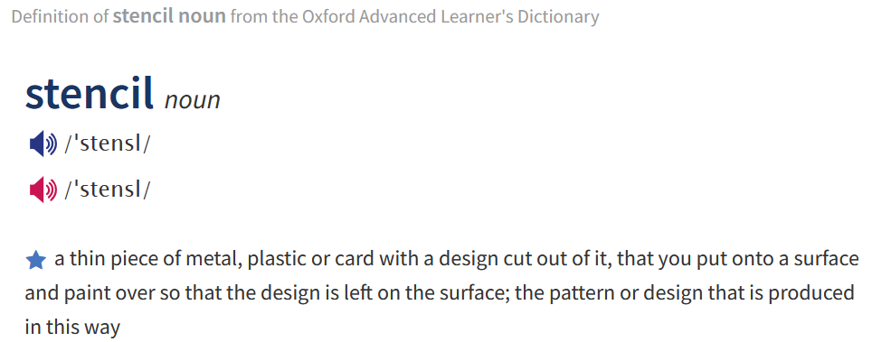
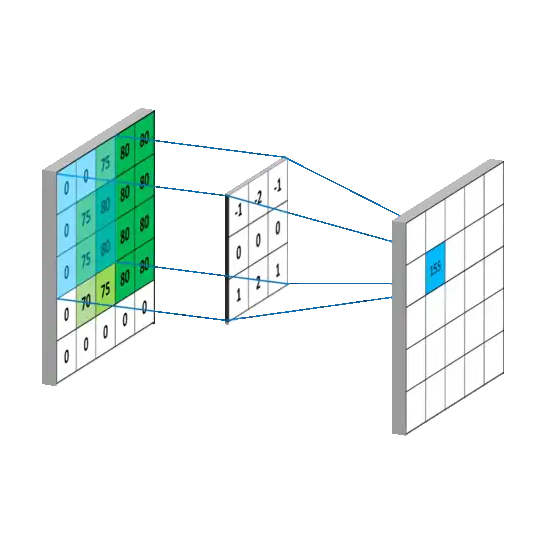

## Stencil 计算

本意是一种更新算法，时刻 t 的一个点，由 t−1 时刻**自己和附近点的加权和**决定。

这种运算在自然科学中十分常用，流体动力学、地球建模、天气模拟都常见。

如热传导：
$$
\begin{matrix}
冷\;冷\;冷\\
冷\;热\;冷\\
冷\;冷\;冷
\end{matrix}
$$

## 那数学上呢？

模板计算，用确定的计算模板**在整个规则网格上反复滑动，并对覆盖到的数据执行同一种运算。**

## 一维情况

$$
\mathbf a=\left( 
\begin{array}{l}
1&2&3&4&5&6
\end{array}
\right)
$$

有模板

$$
\mathbf w=\left( 
\begin{array}{l}
a&b&c
\end{array}
\right)
$$

计算范式即

$$
r_k=\sum_{i=k}^{k+2}a_iw_i
$$

则有

$$
1处: r_1=1a+2b+3c\\
2处: r_2=2a+3b+4c\\
3处: r_3=3a+4b+5c\\
4处: r_4=4a+5b+6c
$$

但是单纯算这样朴素乘加并不合适，我们有很多矩阵计算的硬件，能不能把这种计算化成**矩阵乘法**呢？反正都是 $\sum a_ib_i$ 乘加的形式~

为了方便讨论，鉴于这里有种对数据加权的样子，称模板向量及其元素为**权重**。

## 方法一

让我们对齐一下：
$$
\begin{align}
1处: r_1=1a+2b + \textcolor{red}{3}&c\\
2处: r_2=2a+\textcolor{red}{3}&b+\textcolor{red}{4}c\\
3处: r_3=\textcolor{red}{3}&a+\textcolor{red}{4}b+5c\\
4处: r&_4=\textcolor{red}{4}a+5b+6c\\
\end{align}
$$
可以发现，随着 stencil 在原数据上滑动，相对于原数据来看，权重也在滑动，只是错了一位而已。

把权重按照滑动的方式排列成一个矩阵，乘上 $\mathbf a$ ：
$$
\begin{bmatrix}
a&b&c&0&0&0\\
0&a&b&c&0&0\\
0&0&a&b&c&0\\
0&0&0&a&b&c
\end{bmatrix}
\begin{bmatrix}
1\\
2\\
3\\
4\\
5\\
6
\end{bmatrix}
=
\begin{bmatrix}
1a+2b+3c\\
2a+3b+4c\\
3a+4b+5c\\
4a+5b+6c
\end{bmatrix}
$$
这种方法中重复排列的是**权重**。

## 方法二

更简单的方法是把每个滑动窗口都抄下来。
$$
1处: r_1=1\textcolor{red}{a}+2\textcolor{red}{b}+3\textcolor{red}{c}\\
2处: r_2=2\textcolor{red}{a}+3\textcolor{red}{b}+4\textcolor{red}{c}\\
3处: r_3=3\textcolor{red}{a}+4\textcolor{red}{b}+5\textcolor{red}{c}\\
4处: r_4=4\textcolor{red}{a}+5\textcolor{red}{b}+6\textcolor{red}{c}
$$
显然，**权重**都是统一的。我们可以把权重**提取出来**作为一个向量：
$$
\mathbf r=\left[ 
\begin{matrix}
r_1\\
r_2\\
r_3\\
r_4
\end{matrix}
\right]=
\left[ 
\begin{matrix}
1&2&3\\
2&3&4\\
3&4&5\\
4&5&6
\end{matrix}
\right]
\left[ 
\begin{matrix}
\textcolor{red}{a}\\
\textcolor{red}{b}\\
\textcolor{red}{c}
\end{matrix}
\right]
=
\left[ 
\begin{matrix}
1\textcolor{red}{a}+2\textcolor{red}{b}+3\textcolor{red}{c}\\
2\textcolor{red}{a}+3\textcolor{red}{b}+4\textcolor{red}{c}\\
3\textcolor{red}{a}+4\textcolor{red}{b}+5\textcolor{red}{c}\\
4\textcolor{red}{a}+5\textcolor{red}{b}+6\textcolor{red}{c}
\end{matrix}
\right]
$$
这种方法中重复排列的是**数据**。

## 推广到二维

如 $3\cross3$ stencil：
$$
\begin{bmatrix}
a & b & c \\
d & e & f \\
g & h & i
\end{bmatrix}
$$
只是把向量换成了二维矩阵而已，运算还是各元素和数据元素乘加。

如在 $(p,q)$ 处的 stencil 计算结果：
$$
y_{p,q} = 
\begin{aligned}[t]
& a x_{p-1,q-1} + b x_{p-1,q} + c x_{p-1,q+1} \\
& + d x_{p,q-1} + e x_{p,q} + f x_{p,q+1} \\
& + g x_{p+1,q-1} + h x_{p+1,q} + i x_{p+1,q+1}
\end{aligned}
$$

---

以此 $3\cross5$ 矩阵为数据来说明。
$$
\begin{bmatrix}
1 & 2 & 3 & 4 & 5 \\
6 & 7 & 8 & 9 & 10 \\
11 & 12 & 13 & 14 & 15
\end{bmatrix}
$$
从一维的小向量的移动，变成了小矩阵的移动。
$$
X_{0,0} = \begin{bmatrix}
1 & 2 & 3 \\
6 & 7 & 8 \\
11 & 12 & 13
\end{bmatrix}\to
X_{0,1} = \begin{bmatrix}
2 & 3 & 4 \\
7 & 8 & 9 \\
12 & 13 & 14
\end{bmatrix}\to
X_{0,2} = \begin{bmatrix}
3 & 4 & 5 \\
8 & 9 & 10 \\
13 & 14 & 15
\end{bmatrix}
$$

## 方法一

$$
y_{p,q}=
\begin{array}[t]{r@{}l@{\quad}l}
& a x_{p-1,q-1} + b x_{p-1,q} + c x_{p-1,q+1} & \makebox[0pt][r]{...... 第1行} \\
& + d x_{p,q-1} + e x_{p,q} + f x_{p,q+1} & \makebox[0pt][r]{...... 第2行} \\
& + g x_{p+1,q-1} + h x_{p+1,q} + i x_{p+1,q+1} & \makebox[0pt][r]{...... 第3行}
\end{array}
$$

二维 stencil 的每一行实际上就是**一个一维 stencil** ！

如第一行：
$$
\begin{pmatrix}
1 & 2 & 3 & 4 & 5 
\end{pmatrix}
\;\text{with}\;
\begin{pmatrix}
a&b&c
\end{pmatrix}
$$
对应 stencil 窗口矩阵中的第一行。
$$
X_{0,0} = \begin{bmatrix}
\textcolor{red}{1} & \textcolor{red}{2} & \textcolor{red}{3} \\
6 & 7 & 8 \\
11 & 12 & 13
\end{bmatrix}\to
X_{0,1} = \begin{bmatrix}
\textcolor{red}{2} & \textcolor{red}{3} & \textcolor{red}{4} \\
7 & 8 & 9 \\
12 & 13 & 14
\end{bmatrix}\to
X_{0,2} = \begin{bmatrix}
\textcolor{red}{3} & \textcolor{red}{4} & \textcolor{red}{5} \\
8 & 9 & 10 \\
13 & 14 & 15
\end{bmatrix}
$$
既然如此，分行计算一维 stencil 的和、累加起来即可。

## 方法二

$$
y_{p,q} = 

 a x_{p-1,q-1} + b x_{p-1,q} + c x_{p-1,q+1} 
 + \dots 
 + g x_{p+1,q-1} + h x_{p+1,q} + i x_{p+1,q+1}
$$

就算是二维，还是一样的乘加结构，只是变成 $k^2$ 个数了。

这种方法对每个维度都比较简单——把所有可能的滑动窗口里面数据一个个抄下来就可以了，不管这个窗口是几维度。
$$
X_{0,0} = \begin{bmatrix}
{1} & {2} & {3} \\
6 & 7 & 8 \\
11 & 12 & 13
\end{bmatrix}\;
X_{0,1} = \begin{bmatrix}
{2} & {3} & {4} \\
7 & 8 & 9 \\
12 & 13 & 14
\end{bmatrix}\;
X_{0,2} = \begin{bmatrix}
{3} & {4} & {5} \\
8 & 9 & 10 \\
13 & 14 & 15
\end{bmatrix}
$$
直接展开**摊平为向量**，记录下所有元素。
$$
\begin{align}
\mathbf x&_{(0,0)}=(1,2,3,6,7,8,11,12,13)\\
\mathbf x&_{(0,1)}=(2,3,4,7,8,9,12,13,14)\\
\mathbf x&_{(0,2)}=(3,4,5,8,9,10,13,14,15)
\end{align}
$$
然后把权重向量也摊平为向量。
$$
\mathbf w = \begin{pmatrix}
a & b &c &\dots&h&i
\end{pmatrix}
$$
然后向量合并为矩阵：
$$
\begin{bmatrix}
\mathbf x_{(0,0)} \\
\mathbf x_{(0,1)} \\
\mathbf x_{(0,2)}
\end{bmatrix}
\mathbf w^\top
=
\begin{bmatrix}
1 & 2 & 3 & 6 & 7 & 8 & 11 & 12 & 13 \\
2 & 3 & 4 & 7 & 8 & 9 & 12 & 13 & 14 \\
3 & 4 & 5 & 8 & 9 & 10 & 13 & 14 & 15
\end{bmatrix}
\begin{bmatrix}
a\\
b\\ 
c\\
\vdots\\
h\\
i
\end{bmatrix}
=
\begin{bmatrix}
1a+2b+3c\dots\\
2a+3b+4c\dots\\
3a+4b+5c\dots
\end{bmatrix}
$$

## 实际上……

- 方法一对应 `TCStencil` 方法。
  - 此方法不适用于我们今天研究所用的硬件，只能用在方阵情况下。
  - 不过我们稍后还会回来探讨这个……
- 方法二对应 `im2row` 方法
  - 但是从各种意义上说，这种方法都太冗余了……

## 从方法二出发

一块 $3\cross6$ 数据：
$$
D=\begin{bmatrix}
1 & 2 & 3 & 4 & 5 & 6 \\
7 & 8 & 9 & 10 & 11 & 12 \\
13 & 14 & 15 & 16 & 17 & 18
\end{bmatrix}
$$
有四个滑动窗口：
$$
X_0 =
\begin{bmatrix}
1 & 2 & 3 \\
7 & 8 & 9 \\
13 & 14 & 15
\end{bmatrix},
\quad
X_1 =
\begin{bmatrix}
2 & 3 & 4 \\
8 & 9 & 10 \\
14 & 15 & 16
\end{bmatrix},
\quad
X_2 =
\begin{bmatrix}
3 & 4 & 5 \\
9 & 10 & 11 \\
15 & 16 & 17
\end{bmatrix},
\quad
X_3 =
\begin{bmatrix}
4 & 5 & 6 \\
10 & 11 & 12 \\
16 & 17 & 18
\end{bmatrix}
$$
如果再把这些展开然后写四遍，那确实有相当相当多的重复信息。

怎么办呢？

---

$$
X_0 =
\begin{bmatrix}
{\color{red}1} & {\color{red}2} & {\color{red}3} \\
{\color{red}7} & {\color{red}8} & {\color{red}9} \\
{\color{red}13} & {\color{red}14} & {\color{red}15}
\end{bmatrix},
\quad
X_1 =
\begin{bmatrix}
{\color{red}2} & {\color{red}3} & {\color{blue}4} \\
{\color{red}8} & {\color{red}9} & {\color{blue}10} \\
{\color{red}14} & {\color{red}15} & {\color{blue}16}
\end{bmatrix},
\quad
X_2 =
\begin{bmatrix}
{\color{red}3} & {\color{blue}4} & {\color{blue}5} \\
{\color{red}9} & {\color{blue}10} & {\color{blue}11} \\
{\color{red}15} & {\color{blue}16} & {\color{blue}17}
\end{bmatrix},
\quad
X_3 =
\begin{bmatrix}
{\color{blue}4} & {\color{blue}5} & {\color{blue}6} \\
{\color{blue}10} & {\color{blue}11} & {\color{blue}12} \\
{\color{blue}16} & {\color{blue}17} & {\color{blue}18}
\end{bmatrix}
$$

观察即可发现，中间两个矩阵里的信息在左右两个矩阵中都出现了。

换言之，我们可以直接把原矩阵信息**切分**成若干块，从而达到信息零冗余。剩余两个矩阵的元素都可以从 $A\;B$ 中得到，
$$
D=

\left[\begin{array}{c:c}
A & B 
\end{array}\right]

\implies A =
\begin{bmatrix}
1 & 2 & 3 \\
7 & 8 & 9 \\
13 & 14 & 15
\end{bmatrix},
\quad
B =
\begin{bmatrix}
4 & 5 & 6 \\
10 & 11 & 12 \\
16 & 17 & 18
\end{bmatrix}
$$
听起来很好，但是怎么算呢？

---

$$
\begin{align}

\mathbf{a}=\mathbf{x}_0 =&
\begin{bmatrix}
{\color{red}1} & {\color{red}2} & {\color{red}3} &
{\color{red}7} & {\color{red}8} & {\color{red}9} &
{\color{red}13} & {\color{red}14} & {\color{red}15}
\end{bmatrix}
\\

\mathbf{x}_1 =&
\begin{bmatrix}
{\color{red}2} & {\color{red}3} & {\color{blue}4} &
{\color{red}8} & {\color{red}9} & {\color{blue}10} &
{\color{red}14} & {\color{red}15} & {\color{blue}16}
\end{bmatrix}
\\

\mathbf{x}_2 =&
\begin{bmatrix}
{\color{red}3} & {\color{blue}4} & {\color{blue}5} &
{\color{red}9} & {\color{blue}10} & {\color{blue}11} &
{\color{red}15} & {\color{blue}16} & {\color{blue}17}
\end{bmatrix}
\\

\mathbf{b}=\mathbf{x}_3 =&
\begin{bmatrix}
{\color{blue}4} & {\color{blue}5} & {\color{blue}6} &
{\color{blue}10} & {\color{blue}11} & {\color{blue}12} &
{\color{blue}16} & {\color{blue}17} & {\color{blue}18}
\end{bmatrix}

\end{align}
$$

$$
W_A = 
\begin{bmatrix}
w_0 & 0 & 0 & 0 \\
w_1 & w_0 & 0 & 0 \\
w_2 & w_1 & w_0 & 0 \\
w_3 & 0 & 0 & 0 \\
w_4 & w_3 & 0 & 0 \\
w_5 & w_4 & w_3 & 0 \\
w_6 & 0 & 0 & 0 \\
w_7 & w_6 & 0 & 0 \\
w_8 & w_7 & w_6 & 0
\end{bmatrix}

W_B = 
\begin{bmatrix}
0 & w_2 & w_1 & w_0 \\
0 & 0 & w_2 & w_1 \\
0 & 0 & 0 & w_2 \\
0 & w_5 & w_4 & w_3 \\
0 & 0 & w_5 & w_4 \\
0 & 0 & 0 & w_5 \\
0 & w_8 & w_7 & w_6 \\
0 & 0 & w_8 & w_7 \\
0 & 0 & 0 & w_8
\end{bmatrix}
$$

## 拓广

实际上，这里的运算和**卷积**很像。

二维窗口在矩阵上滑动、跟对应权重相乘、得到结果累加输出……

上面方法二实际可以认为就是迁移卷积计算方法到 stencil。

